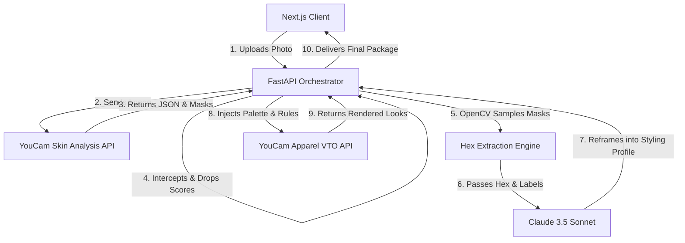

# Aura Reframe 

> **Every Skin AI app tells you what's wrong with your face. Aura Reframe is the first one that refuses to.**

[](https://nextjs.org/)
[](https://fastapi.tiangolo.com/)
[](https://www.perfectcorp.com/business)
[](https://anthropic.com)

Aura Reframe is a dignity-focused styling agent built for people navigating visible skin conditions (vitiligo, burn/surgical scarring, chemo-related changes, chronic eczema). 

We hijacked YouCam's diagnostic API to permanently delete its "flaw" scores, using OpenCV and Claude to translate raw skin data into an empowering, high-fashion color palette for Apparel VTO. 

**We don't fix your skin. We style it.**

---

## 🏗 System Architecture

Aura Reframe utilizes a strictly decoupled architecture to enforce privacy and guarantee that diagnostic scores never reach the client UI.



### Core Components
1. **The Interception Layer (`backend/main.py`)**: A FastAPI service that securely communicates with YouCam APIs. It strictly drops all numerical "severity scores" from the Skin Analysis payload before they can ever be transmitted to the frontend.
2. **The Color Engine (`backend/core/color_extraction.py`)**: Uses `OpenCV` and `numpy` to isolate the specific pixel regions identified by the YouCam masks, running K-Means clustering to extract the top dominant hex colors of the skin's structural variations.
3. **The Reframing Engine (`backend/core/reframe_llm.py`)**: A Claude 3.5 Sonnet integration locked behind a heavily engineered system prompt. It is strictly forbidden from using medical/diagnostic vocabulary (e.g., "lesion", "severe") and translates the raw color data into a high-fashion, structural styling profile.
4. **The Canvas Interaction (`frontend/src/components/MorphRevealImage.tsx`)**: A custom, zero-framework HTML5 Canvas rendering engine. It utilizes 60-point quadratic curves and alpha-fading blob trails to create a 60fps `destination-out` compositing effect, allowing users to organically wipe away their styled VTO garments to reveal their underlying structural data map.

---

## 🚀 Getting Started

### Prerequisites
- Node.js (v18+)
- Python (3.10+)
- YouCam API Keys (Skin Analysis & Apparel VTO)
- Anthropic API Key (Claude 3.5 Sonnet)

### Backend Setup (FastAPI)
1. Navigate to the backend directory:
   ```bash
   cd backend
   ```
2. Create your virtual environment and install dependencies:
   ```bash
   python3 -m venv venv
   source venv/bin/activate
   pip install -r requirements.txt
   ```
3. Create a `.env` file in the `backend/` directory:
   ```env
   YOUCAM_API_KEY=your_key_here
   CLAUDE_API_KEY=your_key_here
   ```
4. Start the orchestration server:
   ```bash
   uvicorn main:app --reload --port 8000
   ```

### Frontend Setup (Next.js)
1. Open a new terminal and navigate to the frontend directory:
   ```bash
   cd frontend
   ```
2. Install the Next.js dependencies:
   ```bash
   npm install
   ```
3. Start the development server:
   ```bash
   npm run dev -- -p 8081
   ```
4. Open [http://localhost:8081](http://localhost:8081) in your browser.

---

## 🎨 Design Philosophy

Aura Reframe rejects the clinical, sterile aesthetics of traditional "SaaS" medical apps. The UI is designed as a brutalist, high-end editorial fashion poster. The massive typography, monochromatic palette, and liquid Canvas interactions are deliberate choices to communicate to the user that they are engaging with a premium fashion styling tool, not a medical diagnostic machine. 

## 📄 License
MIT License. See `LICENSE` for more information.
